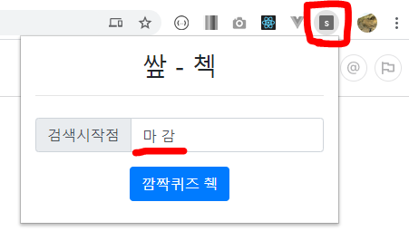
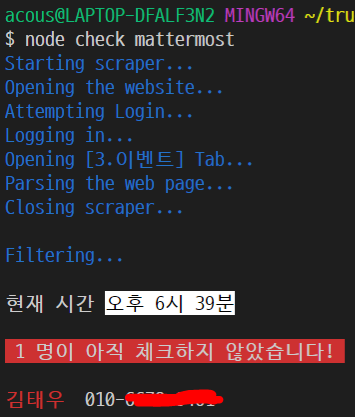

# 메러모스트 깜짝퀴즈 체크 (서로서로 도와요)

이 미니 프로젝트의 목적은 "현재 시간까지 깜짝 퀴즈에 참여하지 않은 사람" 을 쉽게 찾는 것입니다.

이 프로젝트는 두 부분으로 나누어져 있습니다. 

1. 크롬 익스텐션
1. Node.js 코드

크롬 익스텐션만으로 필요한 기능을 더 빠르고 쉽게 수행할 수 있습니다. 따라서 Node.js 코드는 후술할 추가 기능이 필요할 경우에만 이용하면 됩니다.

실전에서 테스트해보지 못한 프로토타입입니다.(퀴즈가 진행되고 있지 않은 상황에 이 코드를 이용하면 예상치 못한 결과가 나올 수 있습니다.) 다음주에 테스트 및 보완할 예정입니다.

## 업데이트 내역
- 한 사람이 여러 개의 글을 연속으로 쓸 때 시간 정보를 제대로 가져오지 못하는 에러가 발생함을 확인했습니다. 급한대로 try catch 문으로 해결.
- 깜짝 퀴즈 외에도 아침 다짐 글 같은 곳에도 쓸 수 있다는 판단이 서 버튼 문구 수정. ("깜짝퀴즈 췍" -> "췍")
- 테스트를 위해 `content.js` 파일의 49번째 줄 즈음의 for loop 의 루프 시작 숫자를 바꿀 때가 있습니다.(`data.length - 1` 부분) 혹시나 제가 다시 **-1** 로 바꾸는 걸 까먹은 상태라면, 꼭 **-1** 로 바꿔주세요.

## 크롬 익스텐션

### 사용법

1. Github 저장소에서 `ZIP` 압축파일을 다운받아 압축을 풀거나 `git clone` 합니다. 

1. 크롬 브라우저의 오른쪽 위에는 세로로 점 3개가 찍힌 아이콘이 있습니다. _아이콘 클릭 > 도구 더보기 > 확장프로그램_ 순서로 들어가 확장프로그램 탭을 엽니다.

    

1. 오른쪽 위의 **개발자 모드** 를 키고, 새로 뜨는 왼쪽의 *압축해제된 확장 프로그램을 로드합니다.* 라는 버튼을 클릭합니다.

    

1. 팝업되는 탐색창에서 다운받은 폴더 안의 `ssafCheckChrome` 폴더를 확장프로그램 폴더 경로로 지정합니다. (전체 프로젝트 폴더가 아님에 유의!)

1. `https://meeting.ssafy.com/` 에 접속합니다. 그리고 **3. 이벤트** 탭으로 들어갑니다. (중요! 다른 탭에서는 작동하지 않습니다.)

1. 오른쪽 위에 뜬 확장프로그램 아이콘을 클릭해서 정상적으로 열리는지 확인합니다. `input` 태그에 있는 "마 감" 은 이전 퀴즈의 끝을 알리는 문구의 일부입니다. 혹시나 최근에 사용된 퀴즈마감이 다를 경우(혹은 따로 마감문구가 없었을 경우) 다른 문구로 바꿀 수 있습니다.

    

    

1. 버튼을 클릭하면 아래와 같은 형식으로 가장 최근의 퀴즈에 아직 참가하지 않은 사람을 찾을 수 있습니다. (주말처럼 진행중인 새로운 퀴즈가 없을 때는 23명이 나오는 게 정상입니다.)

    

    진행중인 퀴즈가 없을 때: 

    

### 반영되어 있는 예외사항
1. 오후 6시 이후의 게시글은 이벤트 인증샷일 것으로 예상하여 카운트 되지 않습니다. (다음날 아침 퀴즈에 반영되지 않습니다.)

### 오류가 발생할 시 or 기능추가 건의
서로의 Github 활동내역을 풍부히 하기 위해 issue 나 pull request 로 문의해주세요.

## Node.js 코드
크롬 익스텐션을 만들 생각을 못했던 삽질의 흔적으로, 몇 가지 추가 기능이 있습니다.

1. 아직 퀴즈에 참가하지 않은 사람의 연락처를 함께 제공합니다. 
1. 크롬으로 사이트에 직접 접속할 필요 없이, 터미널 명령만으로 체크할 수 있습니다.

> 주의! 개인정보(전화번호) 보호와 접속 아이디, 비밀번호 보호를 위해 코드 실행을 위해 필요한 2개 파일을 github 에 올리지 않았습니다. 코드를 테스트하고 싶은 분은 단톡방에 따로 올릴 압축파일을 풀어 프로젝트 폴더에 추가한 후 이용하세요.

### 사용법

1. Node.js 설치가 필요합니다. [node.js](https://nodejs.org/) 사이트에서 추가적인 옵션 없이 설치합니다. (추가 옵션 설치시 시간이 오래 걸리고 예상치 못한 프로그램이 설치될 수 있습니다.)

    

1. Node.js 설치가 제대로 되었음을 터미널에서 `node -v` 명령어로 확인할 수 있습니다. (버전정보 출력)

    

1. `cd` 명령어를 활용해 Github 프로젝트 폴더 경로로 접근한 후, `npm install` 명령어로 필요한 라이브러리를 설치합니다.

    

1. 설치가 완료되었다면 이제 명령어로 정보를 받아볼 수 있습니다.

1. `node check mattermost` 명령어는 현재 시간 진행되고 있는 퀴즈에 참가하지 않은 사람을 연락처와 함께 출력합니다.

    

1. `node check mattermost-log` 는 위 명령어의 결과가 맞는지 확인하기 위해 퀴즈 답을 작성한 사람들의 글을 모두 출력합니다. (그다지 쓸모가 있진 않은듯)

    

## 추가
- 재택근무가 얼마나 길어질 지 모르겠지만(시스템이 바뀔 수도 있고) 조금이라도 도움이 되었으면 해서 만들었습니다.
- 제가 한 번 까먹고 참여 못해서 만든 것도 맞습니다. 인정.
- 이 프로젝트에 대해 궁금한 사항이 있으면 언제든 물어봐주세요.
- 추가기능도 시도해 볼 생각입니다. (자동 퀴즈참여라던가 흠흠..)